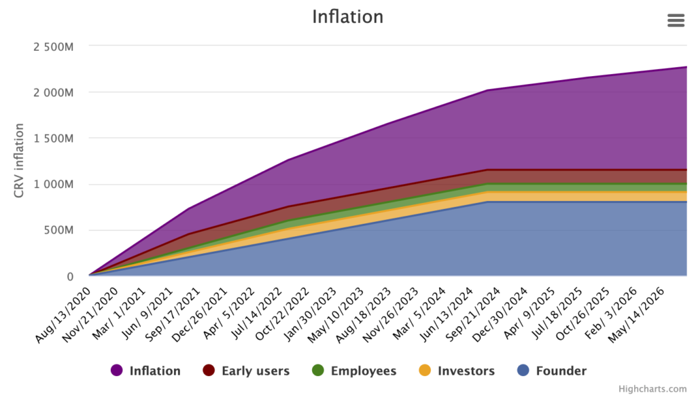
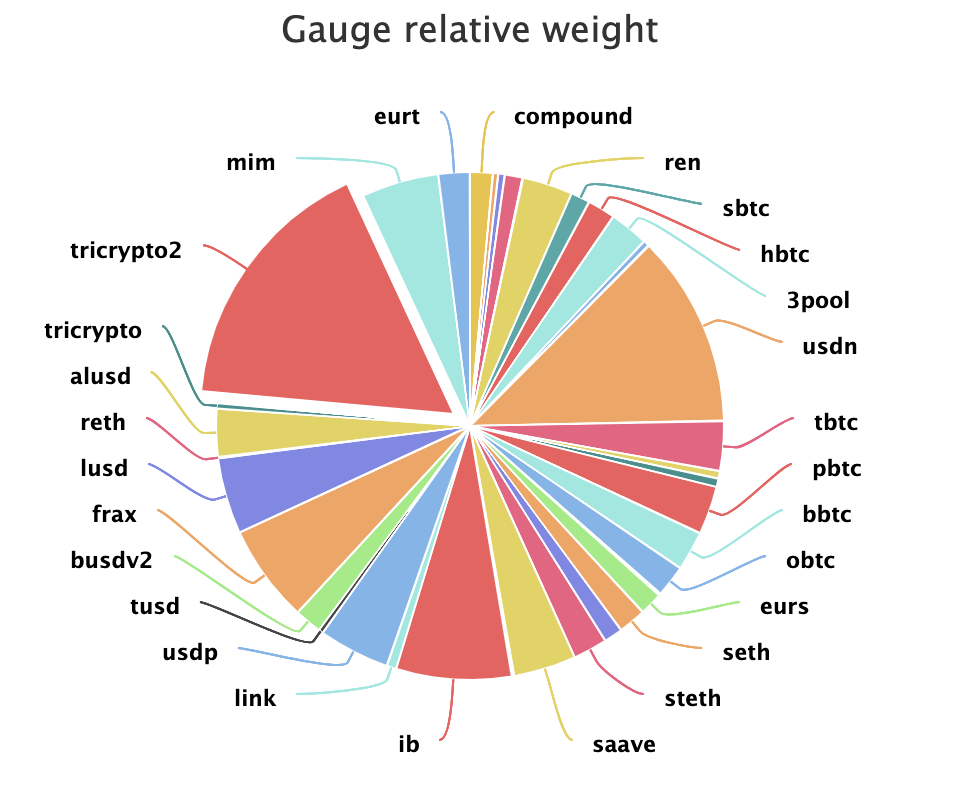

# Applications III: Curve Reward tAPY

## [🎥 Video 19: Applications III 🎬](https://youtu.be/usZ8SXMY6iA)

Sample application: Calculate Curve estimated Reward tAPY from on-chain data.

### CURVE tAPY CALCULATION

        > tAPY = (crv_price * inflation_rate * relative_weight * 12614400) / (working_supply * asset_price * virtual_price)

### CURVE REWARDS
Each week veCRV holders vote on which pools should receive the most Curve rewards.  The value fluctuates and is not guaranteed, so precise on-chain calculation is useful.  Details at [https://dao.curve.fi/](https://dao.curve.fi/)

### CURVE INFLATION

Curve has a preset inflation schedule for the next several centuries.  This emissions rate is a callable function of the $CRV token.

	> crv.rate()

### CURVE RELATIVE WEIGHT

The percentage of rewards emitted to each pool, as voted on each week.

	> gauge_controller.gauge_relative_weight(pool_rewards_address)

