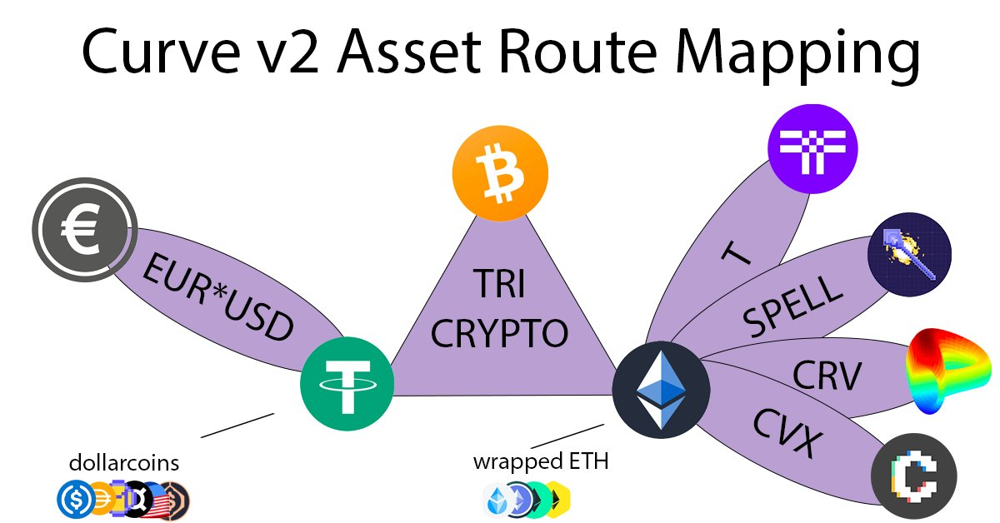

# Routing I

## [🎥 Video 28 Recursive Routing 🎬](https://youtu.be/ZsGaHlXNNpA)

The advent of Curve v2 opens the possibility of complex routing.

The video describes a method of using recursion to identify shortest paths between coins.  This may change as Curve releases the v2 factory, and would not be ideal for finding optimal paths.

For more resources on recursive programming and route optimizatoin:

 * [https://medium.com/@daniel.oliver.king/getting-started-with-recursion-f89f57c5b60e](https://medium.com/@daniel.oliver.king/getting-started-with-recursion-f89f57c5b60e)
 * [https://towardsdatascience.com/train-your-mind-to-think-recursively-in-5-steps-8f85c0e0eb81](https://towardsdatascience.com/train-your-mind-to-think-recursively-in-5-steps-8f85c0e0eb81)
 * [https://mitpress.mit.edu/sites/default/files/sicp/index.html](https://mitpress.mit.edu/sites/default/files/sicp/index.html)
 * [http://elvex.ugr.es/decsai/iaio/doc/1974%20ABSTRIPS.pdf](http://elvex.ugr.es/decsai/iaio/doc/1974%20ABSTRIPS.pdf)
 * [https://researchspace.auckland.ac.nz/bitstream/handle/2292/190/230.pdf](https://researchspace.auckland.ac.nz/bitstream/handle/2292/190/230.pdf)
 * [https://www.aaai.org/ocs/index.php/SOCS/SOCS11/paper/viewFile/4039/4361](https://www.aaai.org/ocs/index.php/SOCS/SOCS11/paper/viewFile/4039/4361)

